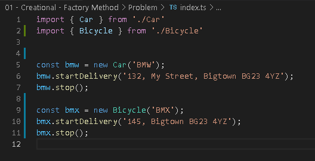
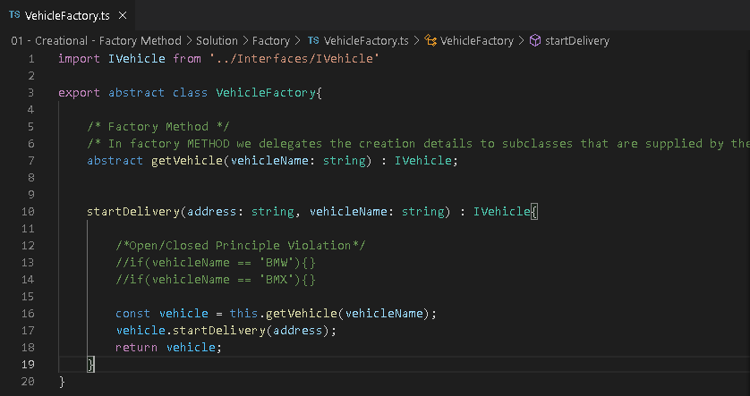
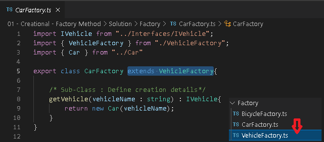

# Factory Method

## O Problema

Imagine que precisamos de objetos(Carro, Bicicleta) para iniciarmos o Delivery.

Agora imagine que vamos instanciar essas classes várias outras vezes em todo o código, Nesse caso a cada implementação e modificação temos que mexer em todas as chamadas, temos um grande acoplamento.

## Solução

Implementamos o VehicleFactory e **Delegamos** os detalhes da criação para as subsclasses

Agora nas SubClasses(Car, Bike, Airplane):

Agora podemos facilmente aumentar o número de veículos, basta criar uma classe, ex: **Airplane** e implementar o **VehicleFactory**, seguindo o Open/Closed Principe.

O resto do código agora somente está acoplado as **Factories**, se fizermos novas implementações/mudanças nas classes originais Car/Bicycle, basta mudar as suas respectivas **Factories** e assim não quebramos o código.
