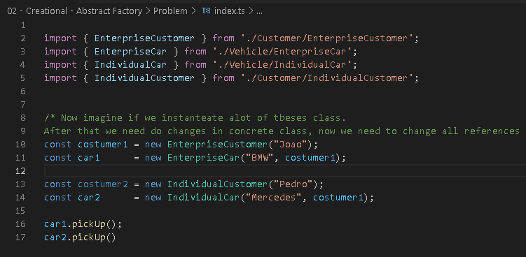
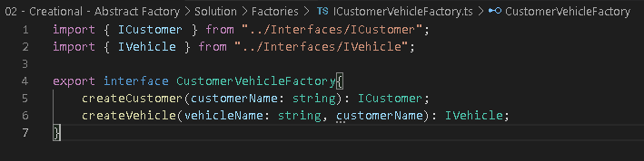
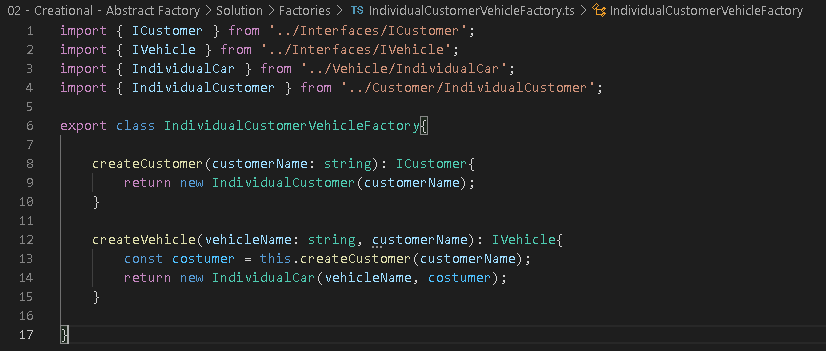
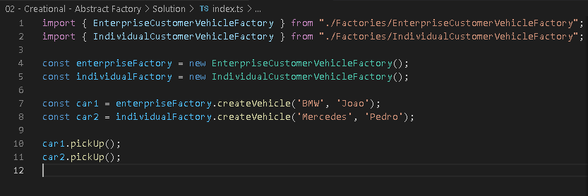

# Factory Method

## O Problema

Imagine que precisamos de objetos(Carro, Bicicleta) para iniciarmos o Delivery.

Agora imagine que vamos instanciar essas classes várias outras vezes em todo o código, Nesse caso a cada implementação e modificação temos que mexer em todas as chamadas, temos um grande acoplamento.

## Solução

Vamos fornecer uma interface para criação de familias de objetos sem especificar suas classes concretas.

Implementamos uma interface(CustomerVehicleFactory) e **Delegamos** os detalhes da criação para as subsclasses

Agora nas SubClasses:

e agora a implementação:

O resto do código agora somente está acoplado as **Factories**, se fizermos novas implementações/mudanças nas classes originais, basta mudar as suas respectivas **Factories** e assim não quebramos o código.
